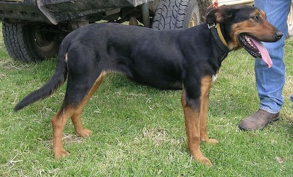

# Huntaway



A Ruby script that checks [Opsgenie](https://opsgenie.com) for the currently
on-call team members, and assigns them a group in [Zendesk](https://zendesk.com).

## Usage

### Clone the repo

```bash
git clone git@github.com:dxw/huntaway.git
```

### Install the dependencies

```bash
bundle install
```

### Add the relevant environment variables

Copy `.env.example` to a file called `.env` and fill in the variables with some real info.

### Run the tasks

There are two tasks:

```bash
bundle exec rake huntaway:assign_incoming_support_user
bundle exec rake huntaway:unassign_extra_users_from_group
```

The first task will:

* Check who is on call for the schedule specified in `Huntaway::OPSGENIE_SCHEDULE_ID`
* Add users to the Zendesk group specified in `Huntaway::GROUP_ID` who are in the schedule but who aren't in the group

This runs as a [Github actions task](https://github.com/dxw/huntaway/actions?query=workflow%3A%22Assign+incoming+support+user+to+the+first+line+support+group%22)
every morning at 6am (UTC).

The second task will:

* Check who is on call for the schedule specified in `Huntaway::OPSGENIE_SCHEDULE_ID`
* Remove all users from the group specified in `Huntaway::GROUP_ID` who aren't currently in the schedule

This runs as a [Github actions task](https://github.com/dxw/huntaway/actions?query=workflow%3A%22Unassign+outgoing+support+user%22)
every afternoon at 3pm (UTC).

-----------------------

(Huntaway photo by <a href="//commons.wikimedia.org/wiki/User:Cgoodwin" title="User:Cgoodwin">Cgoodwin</a> - <span class="int-own-work" lang="en">Own work</span>, <a href="https://creativecommons.org/licenses/by/3.0" title="Creative Commons Attribution 3.0">CC BY 3.0</a>, <a href="https://commons.wikimedia.org/w/index.php?curid=3712682">Link</a>)
